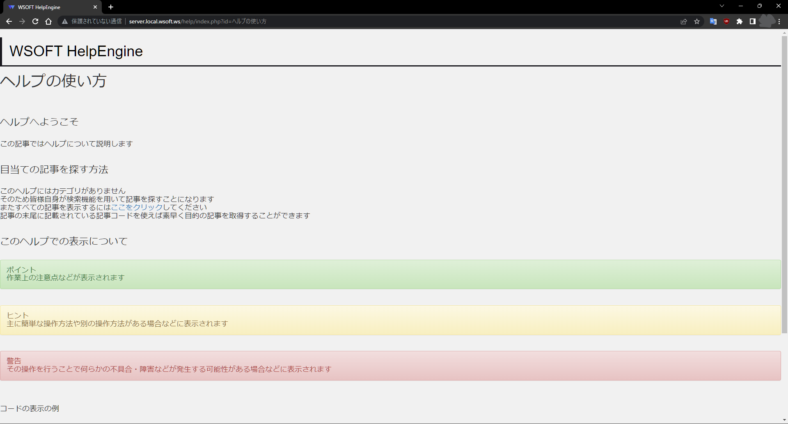

# WSOFT HelpEngine


これは、WSOFTScriptのサイトやWebSailingNXヘルプ、WebSailing開発者ヘルプ、WSTubeヘルプなど従来WSOFTのサイトで公開していたヘルプ記事を表示するためのプログラムです。

最低限の表示機能と検索機能があり、それぞれの記事はHTMLで記述します。

また、`config.php`を編集することである程度カスタマイズできるほか、`index.php`を直接編集すればもっとカスタマイズできます。

表示するべき記事が見つからなかった場合は`error.html`が、トップページでは`toppage.html`が表示されます。これも、変更できます。

このプロジェクトは、Bootstrapの成果物を含んでいます。

```js
/*!
 * Bootstrap v3.3.4 (http://getbootstrap.com)
 * Copyright 2011-2015 Twitter, Inc.
 * Licensed under MIT (https://github.com/twbs/bootstrap/blob/master/LICENSE)
 */
```

また、このプロジェクトは、Google Code Prettifyの成果物を含んでいます。

```js
/*

 Copyright (C) 2013 Google Inc.

 Licensed under the Apache License, Version 2.0 (the "License");
 you may not use this file except in compliance with the License.
 You may obtain a copy of the License at

      http://www.apache.org/licenses/LICENSE-2.0

 Unless required by applicable law or agreed to in writing, software
 distributed under the License is distributed on an "AS IS" BASIS,
 WITHOUT WARRANTIES OR CONDITIONS OF ANY KIND, either express or implied.
 See the License for the specific language governing permissions and
 limitations under the License.

 Copyright (C) 2006 Google Inc.

 Licensed under the Apache License, Version 2.0 (the "License");
 you may not use this file except in compliance with the License.
 You may obtain a copy of the License at

      http://www.apache.org/licenses/LICENSE-2.0

 Unless required by applicable law or agreed to in writing, software
 distributed under the License is distributed on an "AS IS" BASIS,
 WITHOUT WARRANTIES OR CONDITIONS OF ANY KIND, either express or implied.
 See the License for the specific language governing permissions and
 limitations under the License.
*/
```